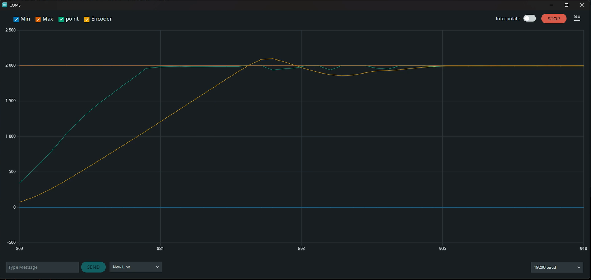

# Arduino DC Motor PID Control

## Overview
This Arduino project implements a PID (Proportional-Integral-Derivative) controller for precise motor speed and position control using an encoder. It's designed to demonstrate the fundamentals of feedback control systems in a simple, accessible manner. The PID controller adjusts motor speed based on the difference between a set point and the actual position reported by the encoder, aiming to minimize this error over time.

## Hardware Requirements
- Arduino Uno (or compatible) board
- DC Motor
- Motor Driver Module
- Rotary Encoder
- Potentiometers for PID tuning (K_P, K_I, K_D)
- Power Supply

## Analysis
I recommend using [SerialAnalyzer](https://github.com/curiores/SerialAnalyzer/tree/main) to analyze signals.